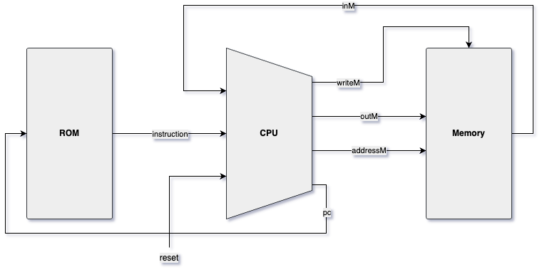

# Nand To Tetris Coursework

> *"An idiot admires complexity, a genius admires simplicity."*
>
> &mdash; Terry A. Davis

### Contents
* [Intro](#intro)
* [Simulation (Coursework)](#a-simulation---from-logic-gates-to-the-hack-computer)
    * [Summary (Notes)](#summary)
* [Beyond Simulation](#b-beyond-simulation)
    * [Transistors](#transistors)
    * [FPGAs](#field-programmable-gate-arrays-fpgas)

## Intro
Building a working, **simulated** *16*-bit computer from first principles. Working through the chapters/projects using Coursera.

**Course Resources**
* [Nand2Tetris Website](https://www.nand2tetris.org/)
* [Coursera: Part I](https://www.coursera.org/learn/build-a-computer)
* [Coursera: Part II](https://www.coursera.org/learn/nand2tetris2)
* [HDL Survival Guide](https://www.nand2tetris.org/hdl-survival-guide)

**Supplementary Resources**
* [[YouTube: ***Sebastian Lague***] Exploring How Computers Work](https://www.youtube.com/watch?v=QZwneRb-zqA&ab_channel=SebastianLague)
* [[YouTube: ***Ben Eater***] Building an 8-bit breadboard computer](https://www.youtube.com/playlist?list=PLowKtXNTBypGqImE405J2565dvjafglHU) (*note*: very long)

## A. Simulation - From Logic Gates to the Hack Computer
This is where the journey starts. Building elementary, 16-bit variant (bus input) & multi-way variant logic gates starting from just NAND.

Building upon these basic gates we build the ALU, Memory and eventually the full-blown (albeit **simulated**) Hack computer.

Similarly to the 16-bit computer, 32-bit (64-bit respectively) computers require 32-bit (64-bit) variants of logic gates.

### Summary
|Notes / Programs|Lecture Slides|Related Project|
|---|---|---|
|[**Boolean Logic**](notes/bool.md)|[*Boolean Logic*](https://drive.google.com/file/d/1MY1buFHo_Wx5DPrKhCNSA2cm5ltwFJzM/view)|1|
|[**Boolean Functions and Gate Logic**](notes/gates.md)|[*Boolean Logic*](https://drive.google.com/file/d/1MY1buFHo_Wx5DPrKhCNSA2cm5ltwFJzM/view)|1|
|[**Boolean Arithmetic and the ALU**](notes/alu.md)|[*Boolean Arithmetic*](https://drive.google.com/file/d/1ie9s3GjM2TrvL7PrEZJ00gEwezgNLOBm/view)|2|
|[**Sequential Logic and Memory**](notes/memory.md)|[*Sequential Logic*](https://drive.google.com/file/d/1boFooygPrxMX-AxzogFYIZ-8QsZiDz96/view)|3|
|[**Machine Language**](notes/machine_lang.md/)|[*Machine Language*](https://drive.google.com/file/d/1HxjPmIZkFHl-BVW3qoz8eD9dqEuEyuBI/view)|4|
|[**Architecture**](notes/architecture.md)|[*Computer Architecture*](https://drive.google.com/file/d/1nEptWuRpFF9zmqlKYq6s1UfDB_dd16vx/view)|5|
|[**Assembler**](notes/assembler.md)|[*Assembler*](https://drive.google.com/file/d/1uKGRMnL-gqk9DsgeN50z0EpHoSMWe6F5/view)|6|
|[**Virtual Machine: Architecture**](notes/vm_architecture.md)|[*VM I: Stack Arithmetic*](https://drive.google.com/file/d/1BPmhMLu_4QTcte0I5bK4QBHI8SACnQSt/view)|7|
|[**Virtual Machine: Flow**](notes/vm_flow.md)|[*VM II: Program Control*](https://drive.google.com/file/d/1BexrNmdqYhKPkqD_Y81qNAUeyfzl-ZtO/view)|8|
|[**Compiler: Syntax Analysis**](notes/compiler_parser.md)|[*Compiler I: Parsing*](https://drive.google.com/file/d/1CM_w6cxQpYnYHcP-OhNkNU6oD5rMnjzv/view)|10|

## B. Beyond Simulation
When it comes to building the Hack computer from real hardware, there are two options:
* Using physical logic gates (e.g. on a breadboard)
* Using Field Programmable Gate Arrays (FPGAs)

At its core, both logic gates and FPGAs are made up of **physical transistors**.

### Transistors
Transistors are the basic building blocks of all logic gates. Although not covered in this course since their inner workings are subject to Physics and Electrical Engineering, understanding how they work is crucial (or at least beneficial) for *really* understanding NAND & logic gates and everything that builds on top of them.

**Resources**
* [[YouTube: ***Lesics***] Transistors, how to they work?](https://www.youtube.com/watch?v=7ukDKVHnac4&ab_channel=Lesics)
* [[YouTube: ***The Engineering Mindset***] Transistors Explained](https://www.youtube.com/watch?v=J4oO7PT_nzQ&ab_channel=TheEngineeringMindset)
* [[YouTube: ***Ben Eater***] Logic Gates from Transistors](https://www.youtube.com/watch?v=sTu3LwpF6XI&list=PLEJ4ZX3tdB692QvbCDnn6wrJGU0kTMY8P&index=2&ab_channel=BenEater)

### Field Programmable Gate Arrays (FPGAs)
[FPGAs](https://en.wikipedia.org/wiki/Field-programmable_gate_array) can be programmed to mimic *any* chip one can think of (within the borders of the actual limitations imposed by the FPGA itself) using Configurable Logic Blocks (CLBs).

**Notes**
* FPGAs **cannot** process *analog* signals - limited to *digital* domain
* large numbers of CLBs possible, which are programmable and can mimic *any* logic gate
    * using Look-Up Tables (LUTs) - think: [Truth tables](https://en.wikipedia.org/wiki/Truth_table#Binary_operations)
* programmable using a HDL such as [Verilog](https://en.wikipedia.org/wiki/Verilog) or [VHDL](https://en.wikipedia.org/wiki/VHDL)

**Resources**
* [[YouTube: ***EEVblog***] What is an FPGA?](https://www.youtube.com/watch?v=gUsHwi4M4xE&ab_channel=EEVblog)
* [[YouTube: ***Charles Clayton***] What is an FPGA?](https://www.youtube.com/watch?v=iHg0mmIg0UU&ab_channel=CharlesClayton)
* [[GitHub: ***geohot***] From the Transistor to the Web Browser](https://github.com/geohot/fromthetransistor)
